# GitMyProject

# 1. 게시판

### - List

* 기본 게시판 리스트 

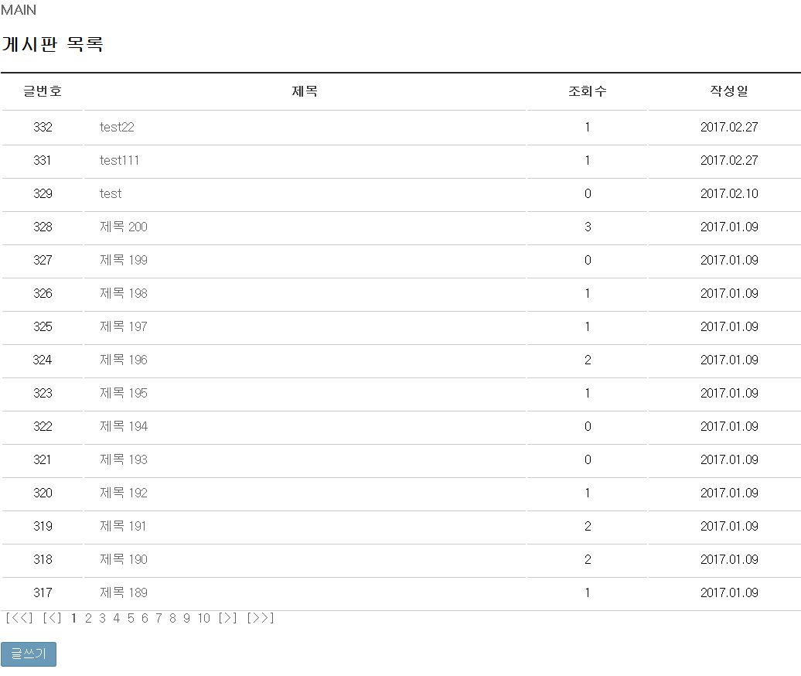

### - Insert

* 게시판 등록 

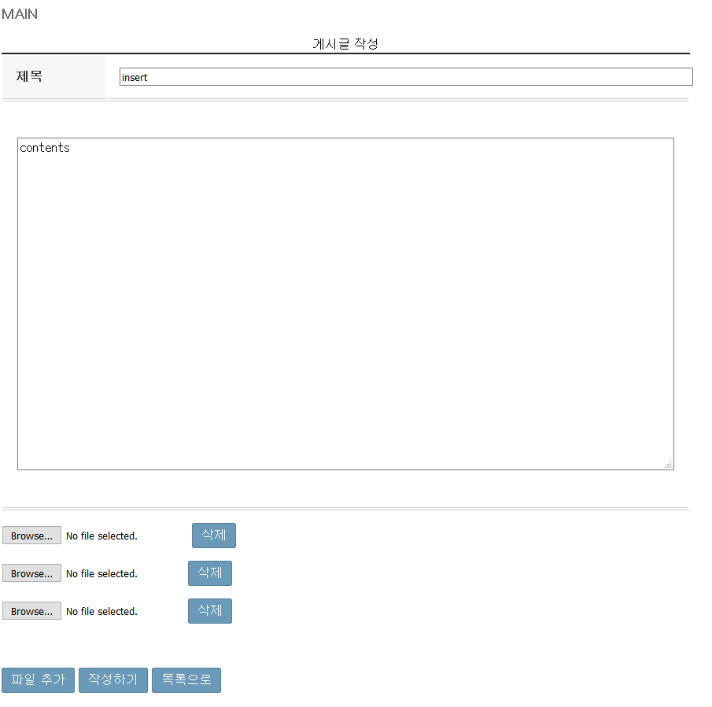

### - View

* 게시판 보기

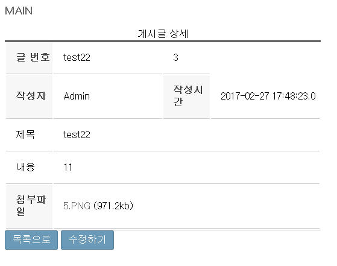

### - Update

* 등록한 내용 수정하기

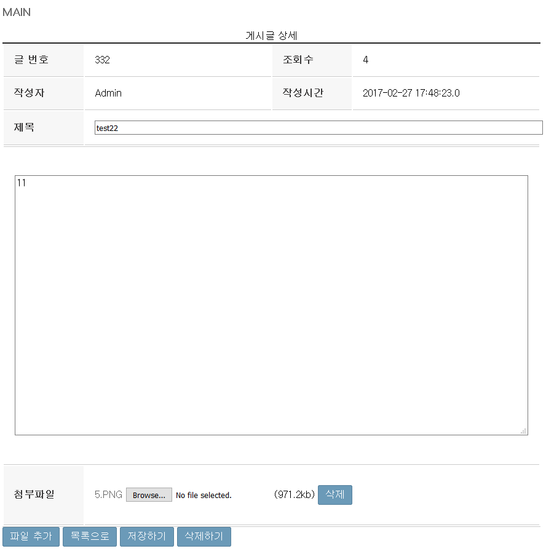

***

 

# 2. 로또 

### - Lotto 번호 생성

* 임의의 번호를 부여받는다. 

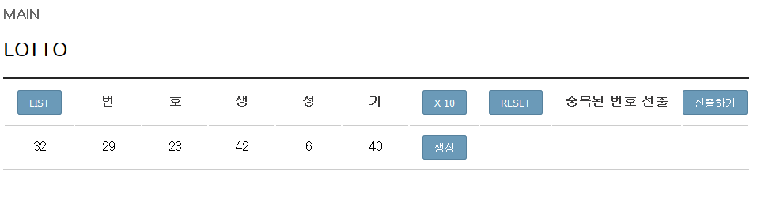

### - Lotto 번호 추가생성

* 사용자가 원하는 만큼 임의번호를 생성한다.

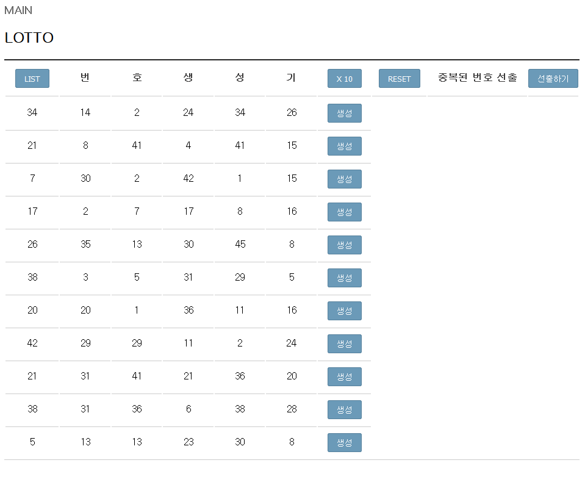

### - Lotto 번호 중복 수 선출

* 임의번호를 받은 수들의 중복값을 구해 많이 중복된 순으로 나타낸다.

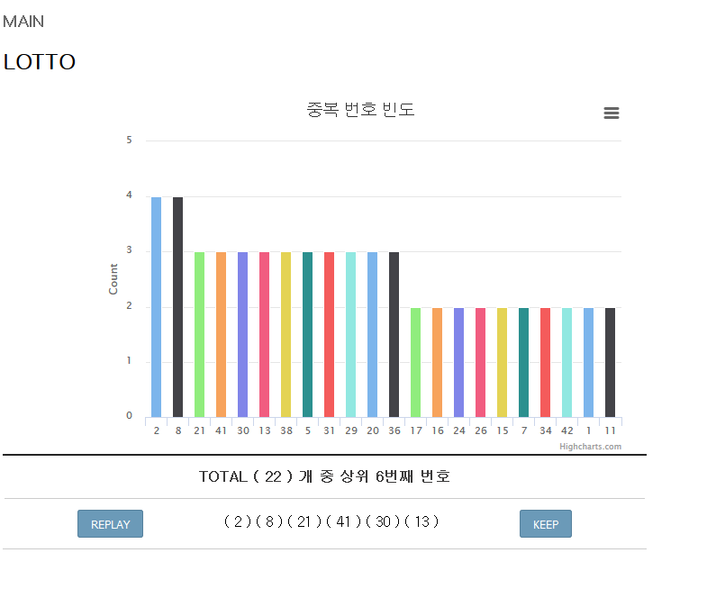

### - Lotto 번호 저장 리스트 

* 사용자가 리스트에 담은 번호들로 로또 추첨을 진행한다.

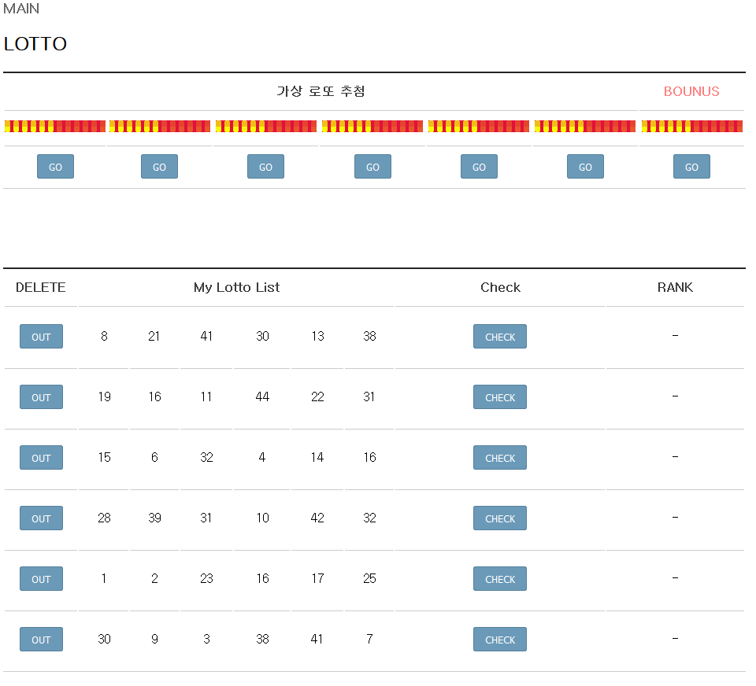

### - Lotto 번호 당첨 결과

* 가상의 당첨번호를 부여받아 리스트의 로또번호들과 비교해서 가상의 당첨결과를 알려준다.

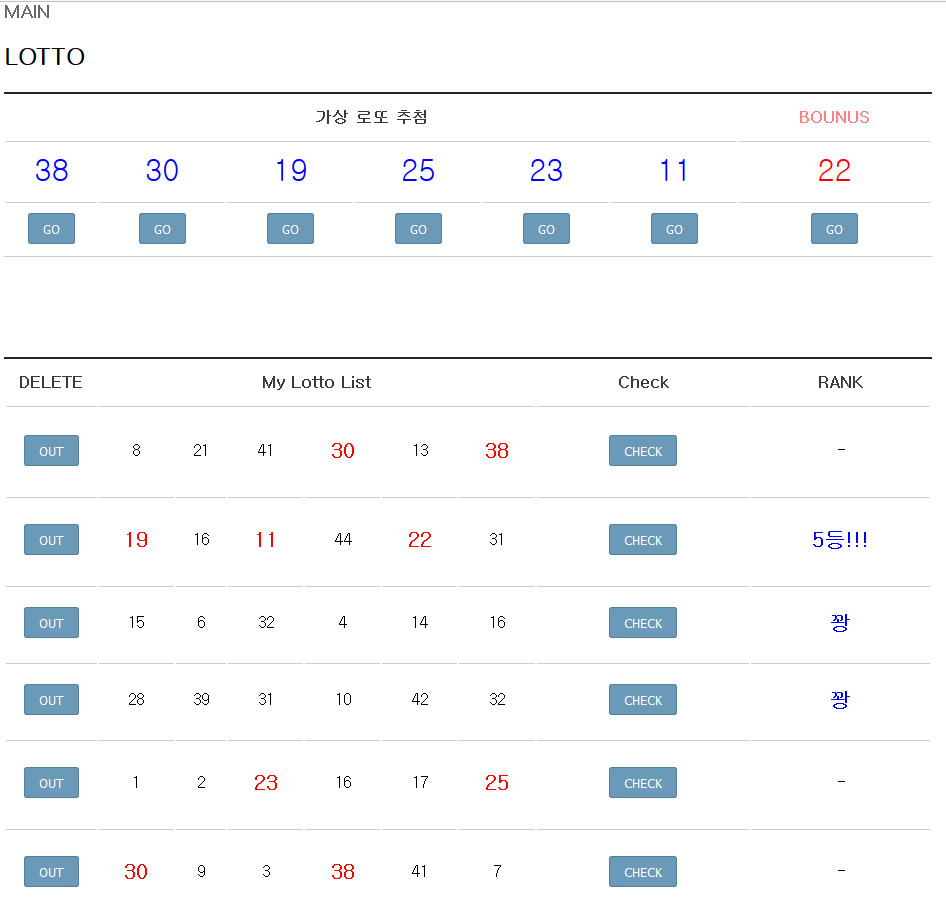

***

# 3. 선택 VS 선택 

### -  게시글리스트

* 사용자들이 등록한 게시물을 리스트 형태로 보여준다.

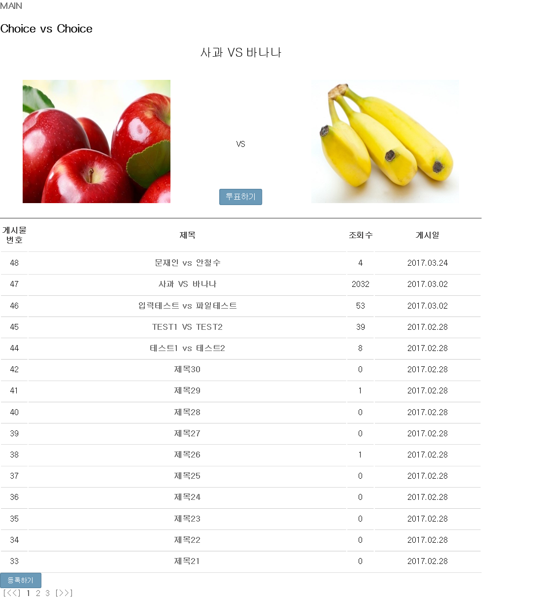

### -  게시글 보기

* 게시글을 보면 직접 투표를 할 수 있다.

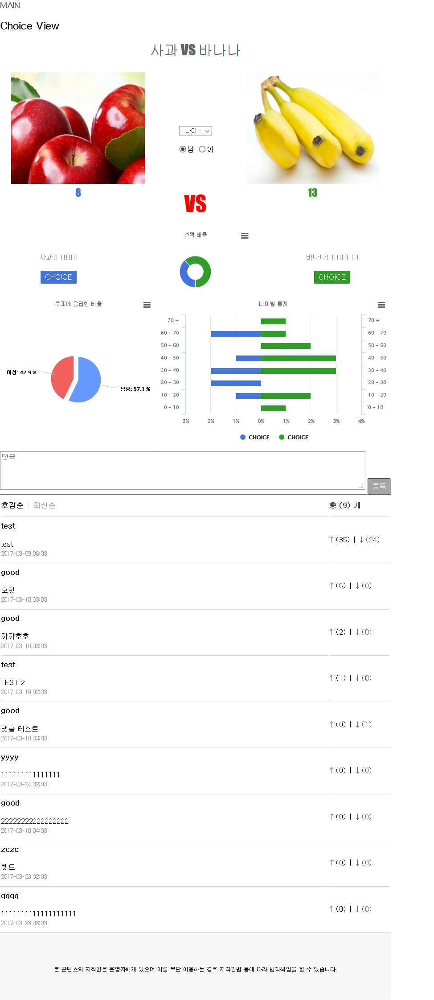

### -  게시글 작성

* 사용자들이 직접 게시글을 작성 할 수 있다.

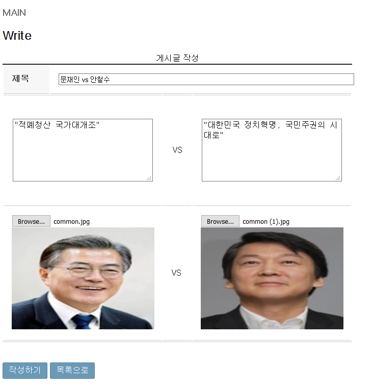

### -  게시글 보기

* 사용자들이 작성한 게시글을 조회수 높은 순으로 메인에 띄운다.

### -  투표하기

* 사용자들이 직접 투표해서 참가 할 수 있다.

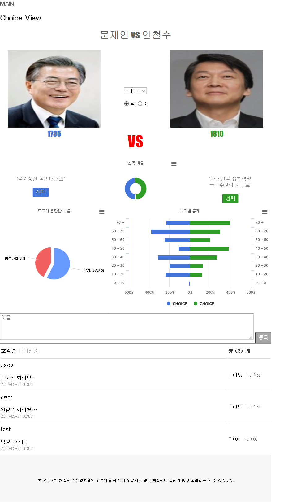

- Link : <http://blog.naver.com/charisma0606/220941020807>

